# Will a Customer Accept the Coupon?

## Context ##

Imagine driving through town and a coupon is delivered to your cell phone for a restaraunt near where you are driving. 
 - Would you accept that coupon and take a short detour to the restaraunt? 
 - Would you accept the coupon but use it on a sunbsequent trip? 
 - Would you ignore the coupon entirely? 
 - What if the coupon was for a bar instead of a restaraunt? What about a coffee house? 
 - Would you accept a bar coupon with a minor passenger in the car? What about if it was just you and your partner in the car? 
 - Would weather impact the rate of acceptance? 
 - What about the time of day?

Obviously, proximity to the business is a factor on whether the coupon is delivered to the driver or not, but what are the factors that determine whether a driver accepts the coupon once it is delivered to them? How would you determine whether a driver is likely to accept a coupon?

**Overview**

The goal of this project is to use what you know about visualizations and probability distributions to distinguish between customers who accepted a driving coupon versus those that did not.

**Data Set Information:**

This data was collected via a survey on Amazon Mechanical Turk. The survey describes different driving scenarios including the destination, current time, weather, passenger, etc., and then ask the person whether he will accept the coupon if he is the driver. 

For more information about the dataset, please refer to the paper: 
Wang, Tong, Cynthia Rudin, Finale Doshi-Velez, Yimin Liu, Erica Klampfl, and Perry MacNeille. ['A bayesian framework for learning rule sets for interpretable classification.' The Journal of Machine Learning Research 18, no. 1 (2017): 2357-2393.](https://archive.ics.uci.edu/ml/datasets/in-vehicle+coupon+recommendation)

**Attribute Information:**

 - destination: No Urgent Place, Home, Work 
 - passanger: Alone, Friend(s), Kid(s), Partner (who are the passengers in the car) 
 - weather: Sunny, Rainy, Snowy 
 - temperature:55, 80, 30 
 - time: 2PM, 10AM, 6PM, 7AM, 10PM 
 - coupon: Restaurant(<$20), Coffee House, Carry out & Take away, Bar, Restaurant($20-$50) 
 - expiration: 1d, 2h (the coupon expires in 1 day or in 2 hours) 
 - gender: Female, Male 
 - age: 21, 46, 26, 31, 41, 50plus, 36, below21 
 - maritalStatus: Unmarried partner, Single, Married partner, Divorced, Widowed 
 - has_Children:1, 0 
 - education: Some college - no degree, Bachelors degree, Associates degree, High School Graduate, Graduate degree (Masters or Doctorate), Some High School 
 - occupation: Unemployed, Architecture & Engineering, Student, Education&Training&Library, Healthcare Support, Healthcare Practitioners & Technical, Sales & Related, Management, Arts Design Entertainment Sports & Media, Computer & Mathematical, Life Physical Social Science, Personal Care & Service, Community & Social Services, Office & Administrative Support, Construction & Extraction, Legal, Retired, Installation Maintenance & Repair, Transportation & Material Moving, Business & Financial, Protective Service, Food Preparation & Serving Related, Production Occupations, Building & Grounds Cleaning & Maintenance, Farming Fishing & Forestry 
 - income: $37500 - $49999, $62500 - $74999, $12500 - $24999, $75000 - $87499, $50000 - $62499, $25000 - $37499, $100000 or More, $87500 - $99999, Less than $12500
 - Bar: never, less1, 1-3, gt8, nan, 4-8 *(feature meaning: how many times do you go to a bar every month?)* 
 - CoffeeHouse: never, less1, 4-8, 1-3, gt8, nan *(feature meaning: how many times do you go to a coffeehouse every month?)* 
 - CarryAway:4-8, 1-3, gt8, less1, never *(feature meaning: how many times do you get take-away food every month?)* 
 - RestaurantLessThan20: 4-8, 1-3, less1, gt8, never *(feature meaning: how many times do you go to a restaurant with an average expense per person of less than $20 every month?) *
 - Restaurant20To50: 1-3, less1, never, gt8, 4~8, nan *(feature meaning: how many times do you go to a restaurant with average expense per person of $20 - $50 every month?)* 
 - toCoupon_GEQ15min:0,1 *(feature meaning: driving distance to the restaurant/bar for using the coupon is greater than 15 minutes)* 
 - toCoupon_GEQ25min:0, 1 *(feature meaning: driving distance to the restaurant/bar for using the coupon is greater than 25 minutes)* 
 - direction_same:0, 1 *(feature meaning: whether the restaurant/bar is in the same direction as your current destination)* 
 - direction_opp:1, 0 *(feature meaning: whether the restaurant/bar is in the same direction as your current destination)*
 - Y:1, 0 *(whether the coupon is accepted)* 

## Jupyter Notebook
Jupyter Notebook : [EDA-AMZN-Coupon.ipynb](https://github.com/mahesh-ai-ml-ds/EDA/blob/main/AMZN-Coupon-Acceptance/EDA-AMZN-Coupon.ipynb)

## EDA : Data Quality Check and Clean-up ##

### Fixing Data Types for Categorical Columns

During the process of reviewing the data types for columns, we discovered that some of the columns have a data type of `int64`. This could potentially cause issues in our analysis, as all columns are supposed to be categorical. To address this, we will convert the data type of all columns with `int64` data type to `object`.

```python
for column in data.columns:
    if data[column].dtype == 'int64':
        data[column] = data[column].astype('object')
```
### Data Record Count

It is important to note that the record count for the dataset is 12,684. This amount may not be sufficient to ensure the accuracy of our analysis and conclusions. As a result, be cautious when interpreting the findings and consider gathering more data to improve the robustness of the analysis.

### Checking and Fixing Null Values
```python
(data.isnull().sum()/(data.shape[0]))*100
```

| Column    | % Null Values | Resolution  |
| ----------|--------------:|-------------|
|car        | 99.14 |Drop Coolumn|
|Bar        | 0.84    |  Replace with "never" |
|CoffeeHouse| 1.71|   Replace with "never"  |
|CarryAway  | 1.19     |   Replace with "never"  |
|RestaurantLessThan20 | 1.02      |    Replace with "never"  |
|Restaurant20To50 | 1.49  |   Replace with "never" |

- Dropping 'car' column
```python
data.drop(columns=['car'],inplace=True)
```

- Replacing Null values with "never"
```python
data.fillna('never', inplace=True)
```

### Checking for Duplicate Records

We can check the duplicate records using the below code.

```python
data.duplicated().sum()
```

The dataset had 74 duplicate records which we drop.
```python
data.drop_duplicates(inplace=True)
```

## Preliminary Analysis ##
### 1. What proportion of the total observations chose to accept the coupon?

<div style="text-align:center">
    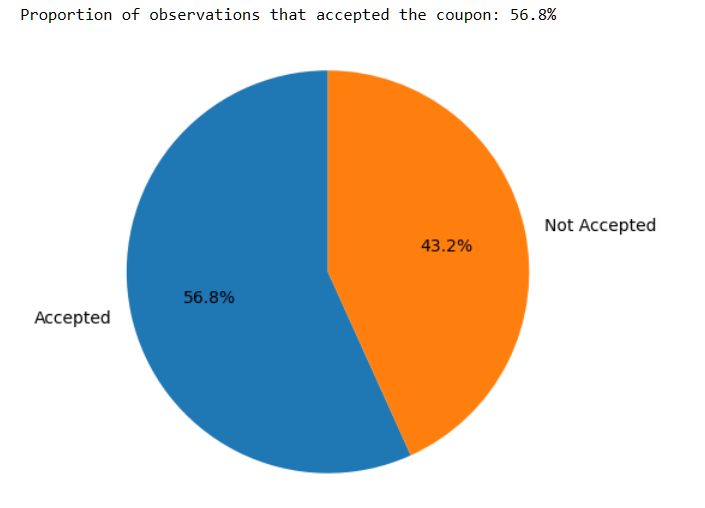
</div>

### 2. What were different types and counts of coupons offered?

<div style="text-align:center">
    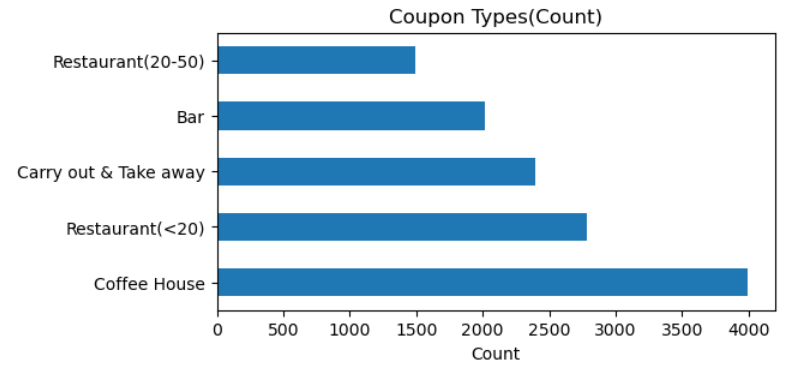
</div>

### 3. What is the distribution of temperature column?

<div style="text-align:center">
    
</div>

## Bar Coupons Analysis ##
### 1. What proportion of bar coupons were accepted?
<div style="text-align:center">
    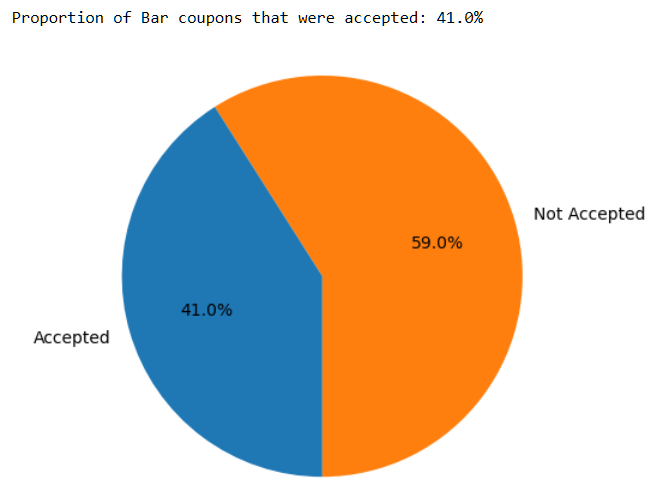
</div>

### 2. Comparison between the acceptance rate of those who went to a bar 3 or fewer times a month to those who went more.
<div style="text-align:center">
    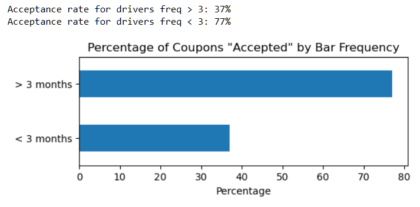
</div>

### 3. Comparison between the acceptance rate of drivers who go to a bar more than once a month and are over the age of 25 to the all others.  Is there a difference?
<div style="text-align:center">
    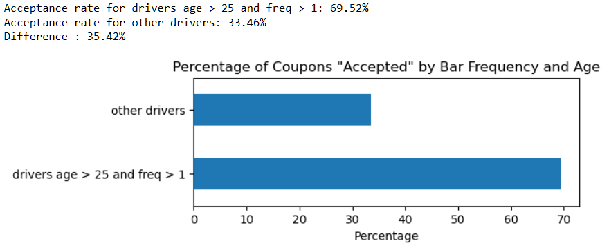
</div>

### 4. Comparison between the acceptance rate of drivers who go to bars more than once a month and had passengers that were not a kid and had occupations other than farming, fishing, or forestry. 
<div style="text-align:center">
    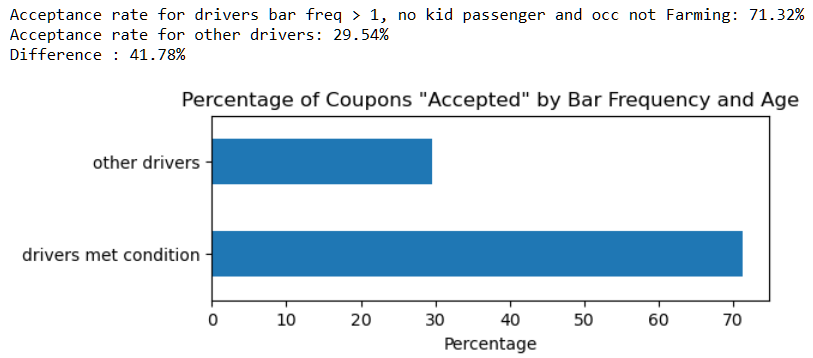
</div>

### 5. Comparison between the those drivers who:
#### -go to bars more than once a month, had passengers that were not a kid, and were not widowed OR
#### -go to bars more than once a month and are under the age of 30 OR
#### -go to cheap restaurants more than 4 times a month and income is less than 50K.

<div style="text-align:center">
    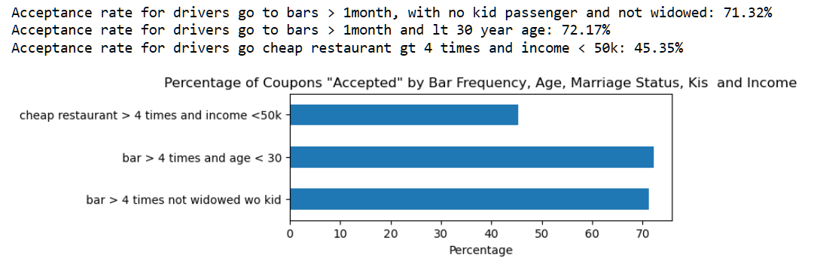
</div>

### Bar Coupon Analysis Summary:
 - Bar coupons only has 41% Acceptance rate, indicating it is not the most popular coupon and only selective group shows interest in accepting the coupons
 - Drivers who visit Bars frequently (more then 4 times) tend to favor Bar coupons compared to the rest of drivers. The difference is 40%
 - Also as expected drivers with the age less then 25 tend to frequent bars more often and are most likely to accept the coupon
 - Drivers without kids and with occupation not being "farming, fishing, or forestry tend to accept coupons more.
 - Drivers with income less then 50k and frequenting the cheap resturants do not tend to accept Bar coupons indicating a different priorities
 - Drivers with Kids do not accept coupons as Kids are not allowed to be in bar

## Trip Analysis  ##

<div style="text-align:center">
    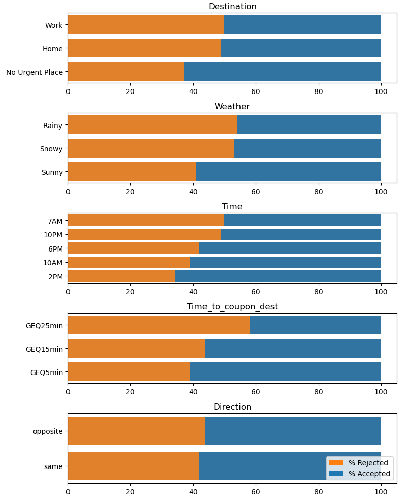
</div>

### Trip Analysis Summary:
 - Drivers will most likely to accept the coupons if they are not driving to any urgent place
 - Good and sunny weather infuence the acceptance rate of the coupons.
 - Early morning and late nights are not the best times of offer couons
 - Majority of coupons are accepted around noon time
 - As the desition of coupon increases, the lesser will be the acceptance arate of the coupon
 - Direciton of travel though does not significantly impact the acceptance rate

## Coupon Analysis ##

<div style="text-align:center">
    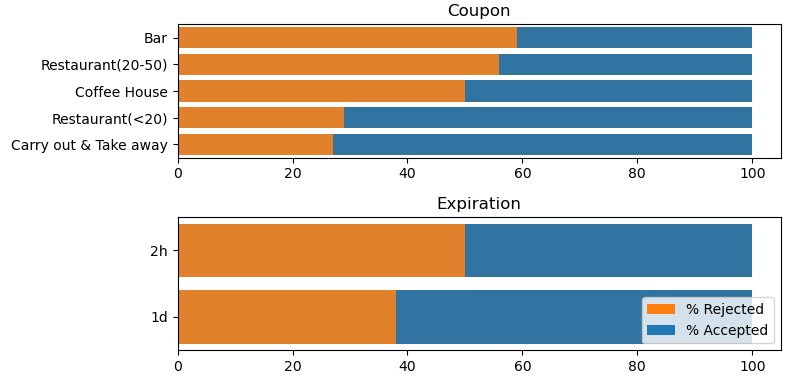
</div>

### Coupon Analysis Summary:
 - Coupons for Restuarants or "Carry out & Take away" has higer accetance rate
 - Coupons which are expiring a day later have higher acceptance rate compared to coupons expiring in 2 hours

## Driver Analysis ##
<div style="text-align:center">
    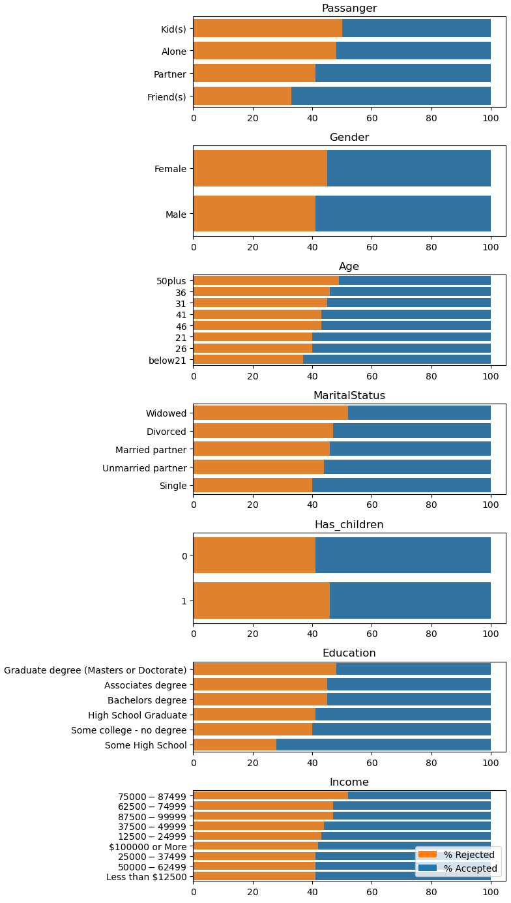
</div>
<div style="text-align:center">
    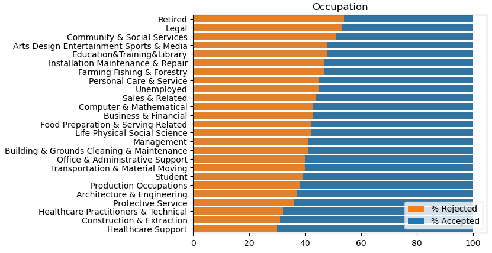
</div>

### Driver Analysis Summary:
 - Driver with a friend or partner passenger will be more likely to accept the coupons, and the opposite is true for the driver with Kids, who are least likely to accept the coupons
 - Group of drivers aged less than 30 are more likely to accept the coupons
 - Drivers who are single or are with unmarried friends will most likely accept the coupon, and widows are least likely to accept the coupons
 - Having just a High School education which also must he impacting low-income drivers, are more likely to accept the coupons
 - Drivers with Master's or Doctorate degrees are most likely to plan and stick to their plans and will be least likely to accept the coupons. With higher education, they should be earning well not to be interested in using coupons
 - Overall, low income will be a motivating factor for the drivers to accept the coupons
 - Healthcare professionals are the biggest group to accept the coupons

## Lifestyle/Preferences Analyis ##

<div style="text-align:center">
    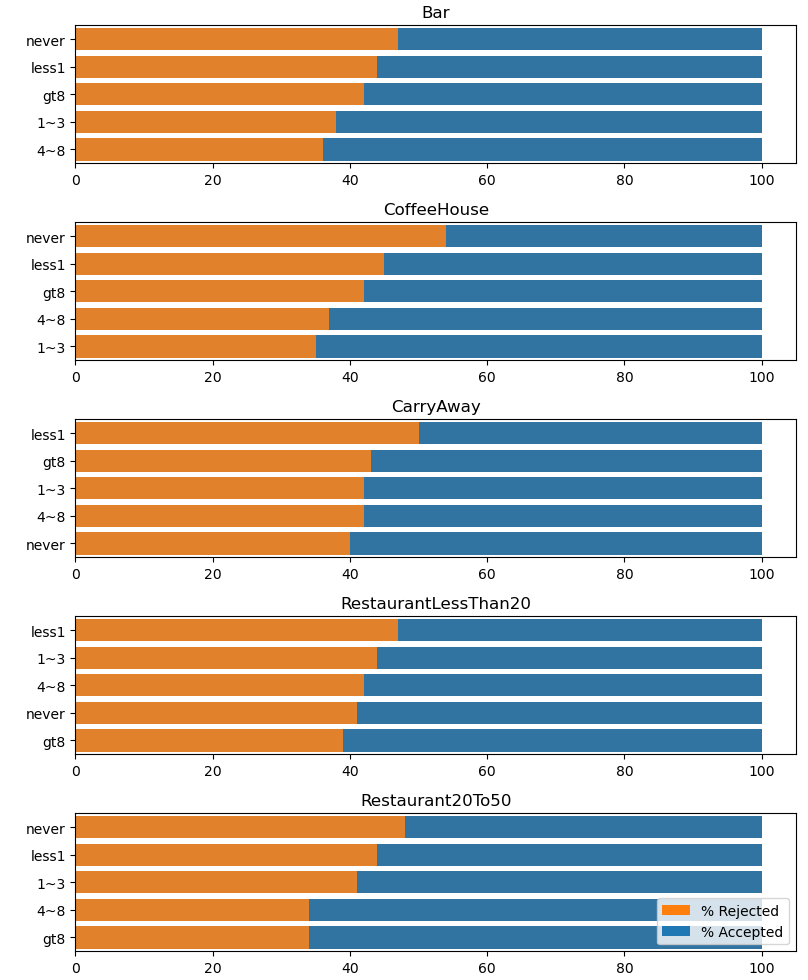
</div>

### Lifestyle/Preferences Analysis Summary:
 - Drivers who frequently visit the Bars and CoffeeHouse are more like to accept the coupons.
 - Drivers who never visited Bars and CoffeeHouse will not be accepting the respective coupons, but surprisingly drivers who have never ordered CarryAway before will most likely accept the coupons. This suggests CarryAway coupons could be used to expose certain restaurants to new customers
 - No difference is observed between the drivers who go to cheaper or more expensive restaurants, as the only factor that positively affects the drivers accepting the coupon is the frequency of their visits. Higher the frequency of the visits, the more likely they are going to accept the coupon
 
 
 ## Conclusion and Next Steps ##
  Let's first answer the prompt questions listed beginning of analysis using the observeations from data.
 
 - Would you accept that coupon and take a short detour to the restaraunt? 
     _The direction of detour though is irrelevant but the time to destination should be lesser for the acceptance based on data._
 - Would you accept the coupon but use it on a sunbsequent trip? 
     _In the data, the preference of coupons with expiry of 1 day was clearly observed.
 - Would you ignore the coupon entirely?_
     _In certian situations the coupon will be ignored entirely e.g. when driving with kids, bar coupons to drivers who never went to bar etc._
 - What if the coupon was for a bar instead of a restaraunt? 
     _Coupon to both bar and restaurant are equally preferred by the drivers with higher histroical frequency of visiting such places._
 - What about a coffee house? Would you accept a bar coupon with a minor passenger in the car? 
     _Acceptance rate of coffehouse is 50% and driver will most likely to reject the bar coupon when driving with a monor_
 - What about if it was just you and your partner in the car? 
     _An inpromptu plan could be accepted when driving with partner and data also suggest that coupon;s acceptance will be higher_
 - Would weather impact the rate of acceptance? 
     _A good weather is conducive to coupon acceptance and bad weather will prompt the drivers to reach their destinations_
 - What about the time of day?
     _Time around noon time is most conducive for drivers to accept the coupons._
     
### Actionable observations ###
- Good and sunny weather positively infuence the acceptance rate of the coupons
- Time around noon time is the best acceptance rates
- Lesser the time it takes driver to reach the destination, more like they are going to accept the coupons
- Restaurant (cheap and expensive) and Carry Out coupones are most likely to be accepted
- Coupons with exiry period of 1 day are more likely to be accepted
- Young drivers(<30) are more likely to accept the coupons
- Drivers with only high school education are more likely to accept the coupons 

### Next Steps ###
- Use the actionable observations to adjust the coupon delivery model and create a more focussed coupon distribution campaign
- Proceed with subsequent encoding of data to generate either Decision Trees or other models to help campaign leaders
