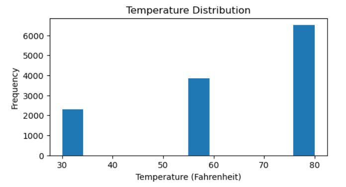

# Will a Customer Accept the Coupon?

## Context ##

Imagine driving through town and a coupon is delivered to your cell phone for a restaraunt near where you are driving. 
 - Would you accept that coupon and take a short detour to the restaraunt? 
 - Would you accept the coupon but use it on a sunbsequent trip? 
 - Would you ignore the coupon entirely? 
 - What if the coupon was for a bar instead of a restaraunt? What about a coffee house? 
 - Would you accept a bar coupon with a minor passenger in the car? What about if it was just you and your partner in the car? 
 - Would weather impact the rate of acceptance? 
 - What about the time of day?

Obviously, proximity to the business is a factor on whether the coupon is delivered to the driver or not, but what are the factors that determine whether a driver accepts the coupon once it is delivered to them? How would you determine whether a driver is likely to accept a coupon?

**Overview**

The goal of this project is to use what you know about visualizations and probability distributions to distinguish between customers who accepted a driving coupon versus those that did not.

**Data Set Information:**

This data was collected via a survey on Amazon Mechanical Turk. The survey describes different driving scenarios including the destination, current time, weather, passenger, etc., and then ask the person whether he will accept the coupon if he is the driver. 

For more information about the dataset, please refer to the paper: 
Wang, Tong, Cynthia Rudin, Finale Doshi-Velez, Yimin Liu, Erica Klampfl, and Perry MacNeille. ['A bayesian framework for learning rule sets for interpretable classification.' The Journal of Machine Learning Research 18, no. 1 (2017): 2357-2393.](https://archive.ics.uci.edu/ml/datasets/in-vehicle+coupon+recommendation)

**Attribute Information:**

 - destination: No Urgent Place, Home, Work 
 - passanger: Alone, Friend(s), Kid(s), Partner (who are the passengers in the car) 
 - weather: Sunny, Rainy, Snowy 
 - temperature:55, 80, 30 
 - time: 2PM, 10AM, 6PM, 7AM, 10PM 
 - coupon: Restaurant(<$20), Coffee House, Carry out & Take away, Bar, Restaurant($20-$50) 
 - expiration: 1d, 2h (the coupon expires in 1 day or in 2 hours) 
 - gender: Female, Male 
 - age: 21, 46, 26, 31, 41, 50plus, 36, below21 
 - maritalStatus: Unmarried partner, Single, Married partner, Divorced, Widowed 
 - has_Children:1, 0 
 - education: Some college - no degree, Bachelors degree, Associates degree, High School Graduate, Graduate degree (Masters or Doctorate), Some High School 
 - occupation: Unemployed, Architecture & Engineering, Student, Education&Training&Library, Healthcare Support, Healthcare Practitioners & Technical, Sales & Related, Management, Arts Design Entertainment Sports & Media, Computer & Mathematical, Life Physical Social Science, Personal Care & Service, Community & Social Services, Office & Administrative Support, Construction & Extraction, Legal, Retired, Installation Maintenance & Repair, Transportation & Material Moving, Business & Financial, Protective Service, Food Preparation & Serving Related, Production Occupations, Building & Grounds Cleaning & Maintenance, Farming Fishing & Forestry 
 - income: $37500 - $49999, $62500 - $74999, $12500 - $24999, $75000 - $87499, $50000 - $62499, $25000 - $37499, $100000 or More, $87500 - $99999, Less than $12500
 - Bar: never, less1, 1-3, gt8, nan, 4-8 *(feature meaning: how many times do you go to a bar every month?)* 
 - CoffeeHouse: never, less1, 4-8, 1-3, gt8, nan *(feature meaning: how many times do you go to a coffeehouse every month?)* 
 - CarryAway:4-8, 1-3, gt8, less1, never *(feature meaning: how many times do you get take-away food every month?)* 
 - RestaurantLessThan20: 4-8, 1-3, less1, gt8, never *(feature meaning: how many times do you go to a restaurant with an average expense per person of less than $20 every month?) *
 - Restaurant20To50: 1-3, less1, never, gt8, 4~8, nan *(feature meaning: how many times do you go to a restaurant with average expense per person of $20 - $50 every month?)* 
 - toCoupon_GEQ15min:0,1 *(feature meaning: driving distance to the restaurant/bar for using the coupon is greater than 15 minutes)* 
 - toCoupon_GEQ25min:0, 1 *(feature meaning: driving distance to the restaurant/bar for using the coupon is greater than 25 minutes)* 
 - direction_same:0, 1 *(feature meaning: whether the restaurant/bar is in the same direction as your current destination)* 
 - direction_opp:1, 0 *(feature meaning: whether the restaurant/bar is in the same direction as your current destination)*
 - Y:1, 0 *(whether the coupon is accepted)* 

## EDA : Data Quality Check and Clean-up ##

### Fixing Data Types for Categorical Columns

During the process of reviewing the data types for columns, we discovered that some of the columns have a data type of `int64`. This could potentially cause issues in our analysis, as all columns are supposed to be categorical. To address this, we will convert the data type of all columns with `int64` data type to `object`.

```python
for column in data.columns:
    if data[column].dtype == 'int64':
        data[column] = data[column].astype('object')
```
### Data Record Count

It is important to note that the record count for the dataset is 12,684. This amount may not be sufficient to ensure the accuracy of our analysis and conclusions. As a result, be cautious when interpreting the findings and consider gathering more data to improve the robustness of the analysis.

### Checking and Fixing Null Values
```python
(data.isnull().sum()/(data.shape[0]))*100
```

| Column    | % Null Values | Resolution  |
| ----------|--------------:|-------------|
|car        | 99.14 |Drop Coolumn|
|Bar        | 0.84    |  Replace with "never" |
|CoffeeHouse| 1.71|   Replace with "never"  |
|CarryAway  | 1.19     |   Replace with "never"  |
|RestaurantLessThan20 | 1.02      |    Replace with "never"  |
|Restaurant20To50 | 1.49  |   Replace with "never" |

- Dropping 'car' column
```python
data.drop(columns=['car'],inplace=True)
```

- Replacing Null values with "never"
```python
data.fillna('never', inplace=True)
```

### Checking for Duplicate Records

We can check the duplicate records using the below code.

```python
data.duplicated().sum()
```

The dataset had 74 duplicate records which we drop.
```python
data.drop_duplicates(inplace=True)
```

## Preliminary Analysis ##
### 1. What proportion of the total observations chose to accept the coupon?

<div style="text-align:center">
    
</div>

### 2. What were different types and counts of coupons offered?

<div style="text-align:center">
    
</div>

### 3. What is the distribution of temperature column?

<div style="text-align:center">
    
</div>

## Bar Coupons Analysis ##
### 1. What proportion of bar coupons were accepted?
<div style="text-align:center">
    
</div>

### 2. Comparison between the acceptance rate of those who went to a bar 3 or fewer times a month to those who went more.
<div style="text-align:center">
    
</div>

### 3. Comparison between the acceptance rate of drivers who go to a bar more than once a month and are over the age of 25 to the all others.  Is there a difference?
<div style="text-align:center">
    
</div>

### 4. Comparison between the acceptance rate of drivers who go to bars more than once a month and had passengers that were not a kid and had occupations other than farming, fishing, or forestry. 
<div style="text-align:center">
    
</div>
